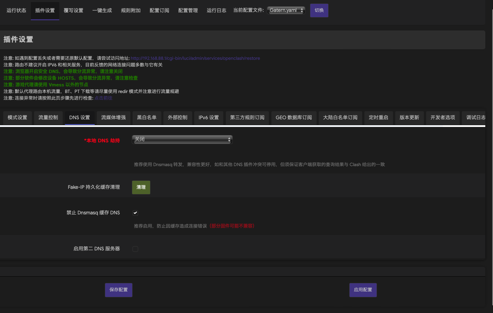
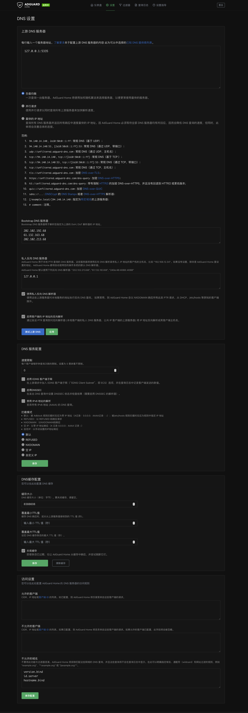

# 教程来自：https://songchenwen.com/tproxy-split-by-dns 大佬，这里只是做记录，也是自己探索配置的过程

# OpenClash

## 1. 插件设置 - 模式设置 - 运行模式： 切换到 Fake-IP（增强）模式

## 2. 插件设置 - DNS 设置 - 本地 DNS 劫持 选择 禁用
## 3. 插件设置 - 流量控制 - 绕过中国大陆 IP 取消勾选
## 4. 插件设置 - 流量控制 - 仅允许内网 开启

## 5. 覆写设置 - DNS 设置 - 自定义上游 DNS 服务器 勾选
## 6. 覆写设置 - DNS 设置 - 追加上游 DNS 勾选
## 7. 覆写设置 - DNS 设置 - 追加默认 DNS 勾选
## 8. 覆写设置 - DNS 设置 - Fake-IP 持久化 勾选
## 9. 覆写设置 - DNS 设置 页面下方 NameServer，FallBack，Default-NameServer 里的 DNS 服务器全都取消勾选，我们只用运营商提供的 DNS 服务器就够了，一般运营商 DNS 都是最快的，也是 CDN 最优化的。

## 10. 插件设置 - GEO 数据库订阅 把 GeoIP Dat 和 GeoSite 这两个库的自动更新打开，都选 Loyalsoldier 的版本，这个是用来给 mosdns 用的。

## 11. 插件设置 -> 开发者选项里，我们自定义一下 iptables 规则

[填写到复写设置-开发者选项里](https://github.com/hsuyelin/mosdns-openclash-adguradhome/blob/main/files/openclash_developer.config)

# MosDNS

## 1. 新增文件在 /etc/mosdns/rule/ 下，并赋予相关权限

[geoip2ipset.sh](https://github.com/hsuyelin/mosdns-openclash-adguradhome/blob/main/files/geoip2ipset.sh)

## 2. 选自定义配置文件，取消 DNS 转发的勾，然后我就直接贴配置了，注意 Clash DNS 端口要改成你自己在 OpenClash 里的配置，LAN IP-CIDR 也要改成你自己的内网配置，这里 mosdns 监听了 5335 端口。我的 Clash DNS 端口：7874，LAN IP-CIDR：192.168.88.1

[填写到自定义规则列表-自定义配置里](https://github.com/hsuyelin/mosdns-openclash-adguradhome/blob/main/files/mosdns.config)

# ADGuardHome

## 1. 在 luci 页面上，开启端口重定向，选择重定向53端口到AdGuardHome

## 2. 在 Web 管理页面上，设置 - DNS 设置中，上游 DNS 服务器内只填写一个 mosdns 的地址 127.0.0.1:5335 #mosdns，私人反向 DNS 服务器写上 127.0.0.1 #dnsmasq。DNS 缓存配置里面，缓存大小看你内存大小填写，乐观缓存勾上

