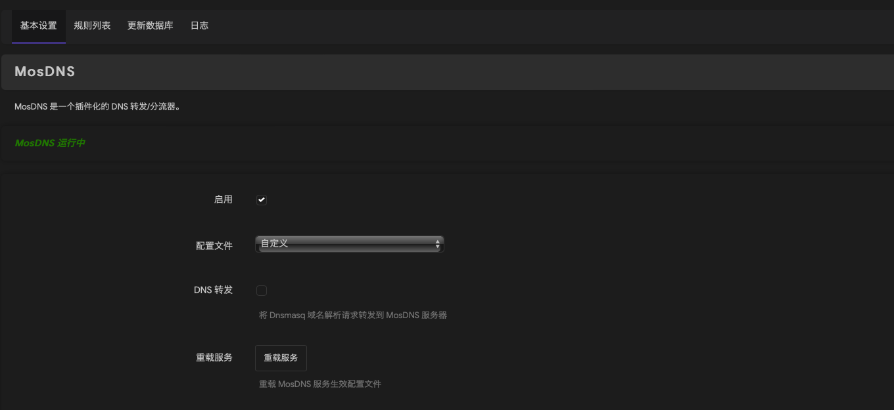

# 教程来自：https://songchenwen.com/tproxy-split-by-dns 大佬，这里只是做记录，也是自己探索配置的过程

# OpenClash

## 1. 运行模式切换到 Fake-IP 增强模式

## 2. 禁用本地 DNS 劫持

## 3. 流量控制中关闭绕过中国大陆 IP，开启仅允许内网。不需要开启任何 IPv6 设置

## 4. 在覆写设置 -> DNS 设置里，开启自定义上游 DNS 服务器，勾选追加上游 DNS、追加默认 DNS，勾选 Fake-IP 持久化。下面 NameServer、FallBack、Default-NameServer 里的 DNS 服务器全部都取消勾选

## 5. 插件设置 -> 开发者选项里，我们自定义一下 iptables 规则

[填写到复写设置-开发者选项里](https://github.com/hsuyelin/mosdns-openclash-adguradhome/blob/main/files/openclash_developer.config)

# MosDNS

## 1. 新增文件在 /etc/mosdns/rule/ 下，并赋予相关权限

[geoip2ipset.sh](https://github.com/hsuyelin/mosdns-openclash-adguradhome/blob/main/files/geoip2ipset.sh)

## 2. 选自定义配置文件，取消 DNS 转发的勾，然后我就直接贴配置了，注意 Clash DNS 端口要改成你自己在 OpenClash 里的配置，LAN IP-CIDR 也要改成你自己的内网配置，这里 mosdns 监听了 5335 端口。我的 Clash DNS 端口：7874，LAN IP-CIDR：192.168.88.1

[填写到自定义规则列表-自定义配置里](https://github.com/hsuyelin/mosdns-openclash-adguradhome/blob/main/files/mosdns.config)

# ADGuardHome

## 1. 在 luci 页面上，开启端口重定向，选择重定向53端口到AdGuardHome

